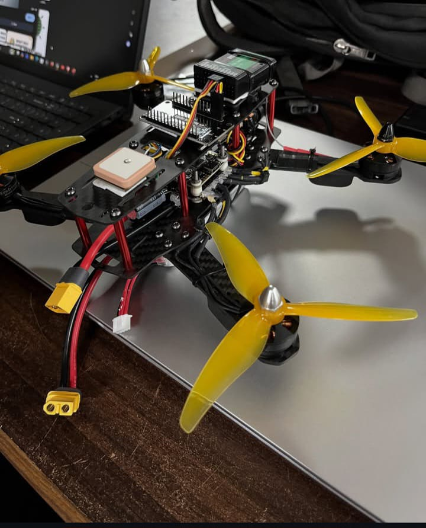
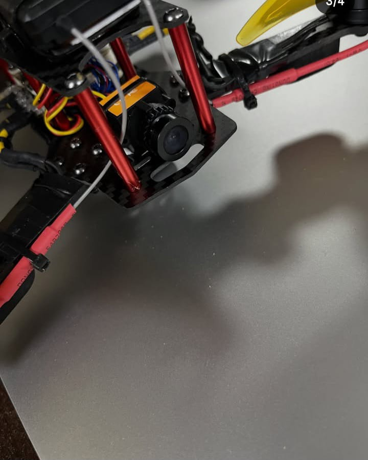
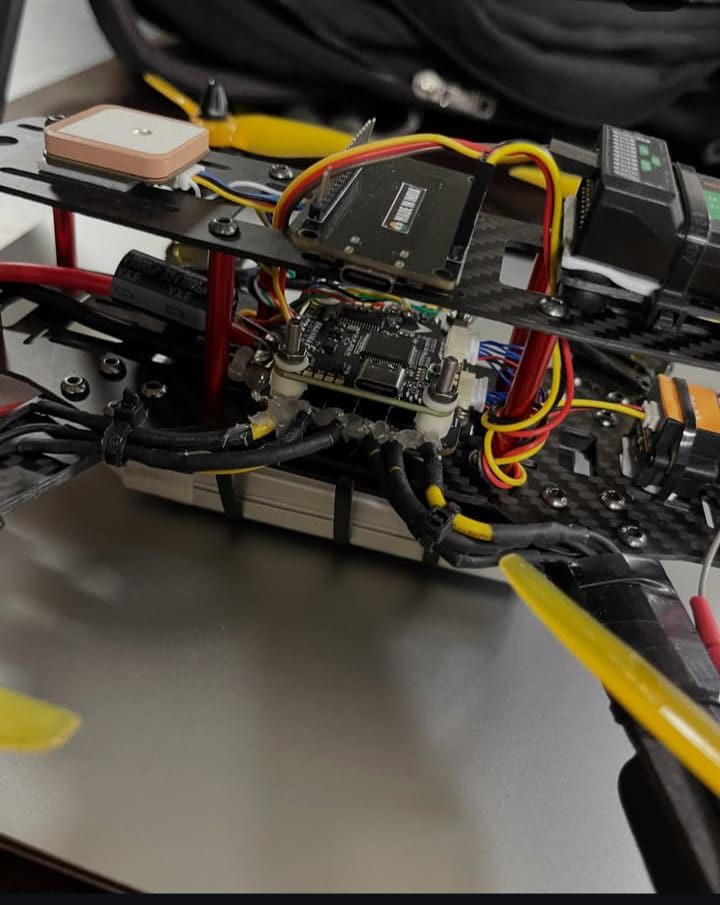

# Sentinel GCS

Sentinel GCS is a private, backend-first ground-control and video-analytics
prototype for authorised security operations. It combines a React operations
console with an isolated FastAPI/Docker processing stack for video ingestion,
object tracking, telemetry fusion, geofencing, events, V2X messages, and an
optional advisory scene-review layer.

> [!IMPORTANT]
> This repository is an engineering prototype, not a certified military,
> aviation, safety, navigation, identity, or port-security product. Never use
> it as the sole basis for safety-critical or enforcement decisions.

## Start here

| Goal | Read / run |
| --- | --- |
| Install and run the full local stack | [Complete setup guide](docs/COMPLETE_SETUP.md) |
| Join the private team and run the stack | [Team setup](docs/TEAM_SETUP.md) |
| Configure or change a camera IP | `./set_camera_source.ps1 -Source <IP-or-URL>` |
| Start the complete local stack | `./start_sentinel.ps1` |
| Understand the processing layers | [Architecture](docs/ARCHITECTURE.md) |
| View the physical drone reference photos | [Drone platform reference](docs/DRONE_PLATFORM.md) |
| Prepare a production deployment | [Deployment and cutover](docs/DEPLOYMENT_AND_CUTOVER.md) |
| Train or release a port model | [Port model release standard](docs/PORT_MODEL_RELEASE_STANDARD.md) |
| Report a vulnerability | [Security policy](SECURITY.md) |

## FPV drone platform

The local Sentinel prototype is designed around this FPV airframe and its
onboard sensing hardware. See the [drone platform reference](docs/DRONE_PLATFORM.md)
for installation notes and full-size photographs.

<table>
  <tr>
    <td align="center"><br><strong>Airframe overview</strong></td>
    <td align="center"><br><strong>Forward camera</strong></td>
    <td align="center"><br><strong>Flight controller and electronics</strong></td>
  </tr>
</table>

### Repository contents

| Path | Purpose |
| --- | --- |
| `app/` | FastAPI API, video pipeline, tracking, fusion, event, V2X, and advisory services |
| `models/` | Private Git LFS runtime model bundle and model documentation |
| `scripts/` | Camera and operational support utilities |
| `tests/` | Automated contract, unit, security, and resilience tests |
| `docs/` | Architecture, deployment, assurance, safety, and performance records |
| `.github/` | Continuous integration and pull-request guidance |

### What is deliberately not in Git

Camera URLs, `.env` secrets, API keys, evidence, databases, logs, and generated
outputs are ignored. Runtime model weights and the curated, attributed port
training dataset are stored in the private repository through Git LFS; run
`git lfs pull` after cloning. See [models/README.md](models/README.md) and
[the port dataset card](training/datasets/port/README.md) for their contracts.

### Architecture at a glance

```mermaid
flowchart LR
  Camera[Authorised camera] --> Capture[OpenCV capture]
  Capture --> YOLO[YOLO11 detection]
  YOLO --> Track[ByteTrack anonymous IDs]
  Track --> Fusion[Sensor fusion]
  Sensors[MAVLink GPS/IMU + LiDAR] --> Fusion
  YOLO -. optional observation .-> Face[Face / pose quality]
  Face -. metadata only .-> Fusion
  Fusion --> Geo[Geolocation]
  Geo --> Rules[Geofence + deterministic risk rules]
  Rules --> Outputs[PostGIS · evidence · UI · MQTT · signed V2X]
  Rules -. approved context only .-> Adviser[Optional scene adviser]
  Adviser -. recommendation only .-> Review[Operator review]

  classDef input fill:#203244,stroke:#6d9fc4,color:#f5f7fa
  classDef compute fill:#24302a,stroke:#5b9c6e,color:#f5f7fa
  classDef rule fill:#382f22,stroke:#c98a3c,color:#f5f7fa
  classDef advisory fill:#313039,stroke:#8f80bd,color:#f5f7fa,stroke-dasharray: 5 4
  class Camera,Sensors input
  class Capture,YOLO,Track,Fusion,Geo,Face,Outputs compute
  class Rules rule
  class Adviser,Review advisory
```



Read the full [system architecture](docs/ARCHITECTURE.md) for service trust
boundaries, data contracts, resilience behaviour, and the responsibility of
each layer.

This is a deterministic, backend-first FPV security processing system. It is ready for a real RTSP/IP camera URL or a Windows USB capture source; no UI configuration is required to start the processing services.

The system is being engineered toward high-assurance operational rigour; it is
not a certified military, aviation, port-security, safety or identity system.
See `HARDENING_ROADMAP.md` for the phased H1-H7 implementation record and
`SECURITY_OPERATIONS.md` for the current security baseline.

## Layered execution path

```text
1. Input adapters     IP/RTSP or Windows DirectShow; MAVLink; LiDAR
2. Perception         YOLO11 target detection -> ByteTrack persistent IDs
3. Fusion             timestamped pose association -> LiDAR/camera geolocation
4. Rules              geofence crossing -> deterministic risk score
5. Storage            independent PostGIS track/event persistence
6. Transport          independent MQTT and signed V2X event delivery
7. Advisory review     optional bounded object-crop request -> external vision LLM
```

The API accepts perception batches with `202 Accepted` and places them on a bounded ingress queue. Fusion, rules, storage, and transport each run in a separate async worker. A PostGIS outage or MQTT slowdown cannot stop capture/detection; queue depth, errors, and drops are exposed by `GET /api/health`.

`GET /api/snapshot` also exposes `vision_metrics` and tracks. Each track states exactly what YOLO identified (`class` and `model_class`), its raw detector `confidence`, rolling `track_mean_confidence`, `track_class_stability`, persistent `track_id`, bounding box, capture timestamp, inference time, optional location, and risk result. Publication requires five recent observations, a stable normalized class, and the configured track-level mean confidence. See `MODEL_REGISTRY.md` and `PERFORMANCE.md` before making any accuracy or latency claim.

## Precision and release evidence

Runtime thresholds reduce weak or unstable alerts; they do not prove model
accuracy. A custom port model can be promoted only after the held-out evaluation
and GPU benchmark pass `training/release_gate.py`. The strict default gate
requires overall and per-class precision/recall, at least 50 explicitly labelled
negative test images, bounded false positives per negative image, bounded
false-positive image rate, p95 latency at most 60 ms, and throughput of at least
20 FPS. These are internal acceptance targets, not a claim of external
certification. The current generic COCO model is not a validated small-boat or cargo-vessel model.

The vision runtime includes the required ByteTrack linear-assignment dependency (`lap`) in `requirements-vision.txt`; it must be present in the built image, not auto-installed during an active mission.

## One-step local start

From PowerShell, run:

```powershell
.\start_sentinel.ps1
```

The launcher starts the authenticated camera bridge when needed, starts the
base services plus the vision profile, waits for readiness, and opens
`http://localhost:8080/`. In VS Code, run **Tasks: Run Build Task**
(`Ctrl+Shift+B`) and choose **Sentinel: Start Complete Stack**. Use
`-WithTelemetry` or `-WithV2X` only when those commissioned adapters are
configured. An available NVIDIA runtime selects the GPU vision override
automatically; pass `-CpuVision` to force CPU inference. The launcher does not
weaken TLS, authentication, or readiness checks.

## Start the base services

```powershell
cd C:\Users\ASUS\Downloads\fpv
docker compose up --build -d
Invoke-RestMethod http://localhost:8080/healthz
Invoke-RestMethod http://localhost:8080/readyz
Invoke-RestMethod http://localhost:8080/api/health
```

The API binds to `localhost` only because the operations page can show live
annotated camera imagery. Do not expose port 8080 directly to a LAN or Internet.
Use an authenticated TLS reverse proxy and an access-control policy before
authorising any remote operations display.

Only the API, PostGIS, and MQTT run by default. The API makes/reconciles its `tracks` table on startup, so the database upgrade works with an existing Docker volume.

## Input adapters

### IP camera / RTSP

When the camera URL is available, set it once with:

```powershell
.\set_camera_source.ps1 -Source 192.168.1.100:8080
```

This validates and writes the complete endpoint to
`config\camera-source.txt`. Both Windows capture launchers read that same file.
You can also edit that one file manually and enter a complete HTTP(S) or
RTSP(S) URL. Camera credentials should be protected because the file is ignored
by Git. Keep runtime/model settings in `.env`:

In VS Code, run **Terminal > Run Task > Sentinel: Change Camera Source** and
enter either `IP`, `IP:port`, or a complete stream URL. The common IP Webcam
form is normalized to `http://IP:port/videofeed`. If the host MJPEG bridge is
already running, it detects the atomic configuration change, closes the old
camera connection, and serves the new source on the next OpenCV reconnect. No
Docker rebuild or `.env` edit is required. The Docker-side
`VISION_VIDEO_SOURCE` remains the stable `host.docker.internal:8090` adapter
address and must not be replaced with the phone IP.

```ini
VIDEO_BACKEND=
YOLO_DEVICE=
```

Then start the worker:

```powershell
docker compose --profile vision up --build
```

If the camera is reachable from Windows but Docker logs show `No route to host` (a common Docker Desktop + phone Wi-Fi boundary), run this small host-side input adapter in a separate PowerShell window:

```powershell
.\run_mjpeg_bridge_windows.ps1
```

In VS Code, use **Terminal > Run Build Task** and select
**Sentinel: Start Camera Bridge** (or press `Ctrl+Shift+B`). This launches the
long-running bridge in its own task terminal, so the PowerShell extension and
IntelliSense remain available. Use **Terminal > Terminate Task** to stop it.

It authenticates requests with the `MJPEG_BRIDGE_TOKEN` from `.env` and forwards the source from `config\camera-source.txt` only to the Docker vision worker at `host.docker.internal:8090`; YOLO/ByteTrack, fusion, geofence/risk, persistence, MQTT, and V2X remain isolated backend services in Docker. Use a fresh random token and protect the host network; production deployment should replace this local bridge with authenticated TLS transport.

On a supported NVIDIA Docker installation, add GPU access:

```powershell
docker compose -f docker-compose.yml -f docker-compose.gpu.yml --profile vision up --build
```

### Windows USB analog/HDMI capture

Keep the base services in Docker and run the vision adapter on Windows:

```powershell
.\run_vision_windows.ps1 -DeviceIndex 0 -Backend dshow
```

The central camera-source file accepts HTTP(S) and RTSP(S) URLs. A custom
GStreamer pipeline can still be supplied explicitly with the vision worker's
environment when required. Do not try to expose a Windows USB capture device as
Linux `/dev/video0` in Docker Desktop.

### MAVLink, GPS/IMU and LiDAR

Set the flight-controller endpoint, for example:

```ini
MAVLINK_ENDPOINT=udp:0.0.0.0:14550
LIDAR_ORIENTATION=downward
```

The bridge parses `GLOBAL_POSITION_INT`, `ATTITUDE`, `SYS_STATUS`, `RADIO_STATUS`, and `DISTANCE_SENSOR`. It associates each detection to the closest telemetry sample inside `TELEMETRY_MAX_SKEW_S`; a fresh downward LiDAR value is preferred over relative altitude for projection height.

Run it with:

```powershell
docker compose --profile telemetry up --build
```

## Geolocation and calibration

The safe default is a clearly marked flat-ground estimate. For calibrated ray-plane mode, measure `CAMERA_FX_PX`, `CAMERA_FY_PX`, `CAMERA_CX_PX`, `CAMERA_CY_PX`, and validate the `CAMERA_TO_BODY_MATRIX` using ground-control points. Only then set:

```ini
ENABLE_RAY_PLANE_GEOLOCATION=true
```

All calculated positions remain marked `approximate`; do not use them as navigational or enforcement-grade locations until field validation demonstrates the required accuracy.

## Events, V2X, and privacy

Geofence entry/exit and transparent risk factors (object class, confidence, restricted zone, quiet hours) become PostGIS and MQTT events. V2X is off by default. To enable the relay, configure a unique source ID and non-empty shared secret, then run the V2X profile:

```ini
ENABLE_V2X=true
V2X_SOURCE_ID=ground-station-01
V2X_SHARED_SECRET=replace-with-a-long-random-secret
```

```powershell
docker compose --profile v2x up --build
```

The current broker configuration is a local development configuration. A deployed V2X system must use authenticated TLS/mTLS transport, key rotation, replay monitoring, and a broker/network operated by the relevant authority.

`V2X_LLM.md` documents the signed event context and the optional advisory evidence flow. An LLM may request or assess extra authorised camera evidence after an event; it cannot alter deterministic risk scores, geofence state, severity, or critical alerts.

For a no-cost prototype option, the implemented OpenRouter `openrouter/free`
vision adapter is an optional seventh layer. It sends a bounded local YOLO
**object** crop only after the operator sets their own API key and enables both
evidence capture and LLM review. It has no effect on security decisions and is
off by default. Follow `LLM_OPENROUTER.md`; free routing has variable model
availability and is not a production SLA.

An operator-funded xAI Grok adapter is also available for the same advisory
object/scene review and structured incident rationale. It is deliberately
prohibited from face identification or matching. See `GROK_ADVISORY.md`.

Google Gemini is also supported as an optional advisory object/scene and event
reviewer. It does not modify YOLO or ByteTrack outputs and cannot identify or
match faces. See `GEMINI_ADVISORY.md`.

To store a rotated Gemini key in both source and live environment files without
echoing it to the terminal, run `./set_gemini_key.ps1`. Do not paste API keys
into chat, logs, screenshots, or source control.

Face observation uses the local OpenCV YuNet ONNX detector behind confirmed
person tracks. It runs at a bounded cadence and always runs on annotated-preview
frames so configured privacy blur is applied without blocking YOLO/ByteTrack.
It produces face boxes, landmarks, quality metadata, and a short-lived anonymous
track link. No embeddings, face gallery, or identity matching is implemented.

## Validation without a camera

The base stack can be checked before a camera URL is supplied:

```powershell
Invoke-RestMethod http://localhost:8080/api/capabilities
Invoke-RestMethod http://localhost:8080/api/health
Invoke-RestMethod http://localhost:8080/api/failsafe
```

Use MAVLink SITL at the default UDP endpoint to validate the telemetry adapter. Run Python tests after the vision/API dependencies are installed:

```powershell
python -m pytest -q
```

For a read-only live layer check, run:

```powershell
.\verify_backend.ps1
```

Use `.\verify_backend.ps1 -ExercisePipeline` only in an authorised test session.
That explicit mode injects one synthetic telemetry point and person detection
inside the demo geofence, then verifies asynchronous event dispatch. See
`FAILSAFE_OPERATIONS.md` for the failure-containment matrix and release gates.

## Mission cockpit and connected-device commissioning

The root URL now serves a responsive local mission cockpit: annotated EO video,
layer readiness, flight telemetry, deterministic alerts, anonymous track IDs,
an offline tactical plot, signed V2X peer status, and the isolated LLM advisory
queue. It deliberately exposes no automatic device-control action.

The V2X gateway publishes a signed ground-station heartbeat and records signed
heartbeats from drones, vehicles, cameras, infrastructure nodes, and protocol
gateways. Use `V2X_DEVICE_ADAPTER.md` for the device message contract and
commissioning sequence. Production deployment still requires an
authority-operated private network, per-device mTLS identity and ACLs, clock
synchronisation, audited key rotation, redundant brokers, field tests, and the
applicable port/aviation/SAE/ETSI accreditation. This implementation is a
mission-critical engineering baseline; it must not be represented as a
certified military system without those independent gates.

The operator interface is organised into Flight, Plan, Sensors, and Systems
workspaces. Plan mode supports a local waypoint draft with route statistics and
JSON export but cannot upload commands to a vehicle. Sensors mode distinguishes
the real EO-01 annotated stream from unconfigured IR, fixed-port, and patrol
vehicle channels. See `GCS_INTERFACE.md` for operator behaviour and authority
boundaries.
