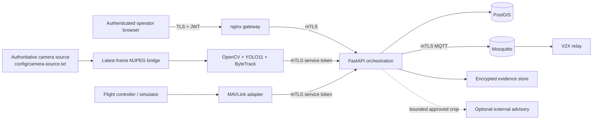

# Sentinel architecture

Status: development architecture, updated 2026-08-22. This document does not assert field qualification.

## Safety boundary

Sentinel observes, plans, records, and advises. Deterministic code owns geofences, risk, alerting, V2X validation, evidence integrity, and mission validation. LLM output is labelled **AI ADVISORY** and has no path to YOLO state, ByteTrack identity, mission upload, MAVLink commands, risk, or alert activation. There is no weapon or autonomous-engagement function. Face processing is anonymous YuNet detection/quality only.

## Service and trust layout

Trust boundaries are: browser/edge, service network, data network, transport network, local evidence filesystem, optional provider egress, and external sensor/vehicle links. Docker networks isolate data and transport paths. Application containers run as UID 10001 with read-only roots, dropped Linux capabilities, `no-new-privileges`, bounded tmpfs, and explicit writable volumes.

## Real-time perception path

```mermaid
flowchart LR
  A[Capture timestamp] --> B[Latest complete frame]
  B --> C[YOLO candidate threshold]
  C --> D[ByteTrack association]
  D --> E[Class-specific temporal confirmation]
  E --> F[Telemetry + range association]
  F --> G[Approximate or calibrated geolocation]
  G --> H[Deterministic rules and risk]
  H --> I[Versioned event]
  I --> J[Encrypted evidence / UI / MQTT / V2X]
```

Capture and publisher boundaries keep one latest item. Slow consumers replace stale work rather than creating video latency. API storage and MQTT egress use bounded durable queues and isolated circuit breakers.

## Correlation and provenance

`DetectionBatch.batch_id` is the frame correlation identifier. It follows detections into tracks and events. Event provenance records detector name/version/weights hash, camera and vehicle, source-frame time, calibration/extrinsics versions and hashes, geofence version, evidence ID/hash, and human review data. UTC epoch timestamps are persisted; monotonic clocks are used for process durations and retry windows.

## Telemetry and geolocation

Telemetry is indexed per `vehicle_id` with bounded histories. Fusion selects the nearest sample for the detection vehicle within `TELEMETRY_MAX_SKEW_S`; range is selected the same way within `LIDAR_MAX_AGE_S`. A miss produces no derived geolocation. Intrinsics and extrinsics profiles are checksummed and camera-bound. A resolution/aspect mismatch disables application of that calibration for the frame. Until controlled reference-target testing establishes a complete error budget, locations report `UNCERTAINTY UNBOUNDED`.

## Mission and event control

Missions are UUID-addressed, optimistically versioned PostGIS records. Validation checks ordering, route structure, terminal action, restricted waypoint inclusion, and restricted-boundary crossings. “Prepare upload” performs readiness checks only; no command adapter is enabled. Event transitions are forward-only: `NEW → ACKNOWLEDGED/UNDER_REVIEW/DISMISSED → RESOLVED/DISMISSED`.

## Data stores

- PostGIS: events, tracks, missions, spatial points/routes, evidence metadata, security findings, and append-only audit chain.
- SQLite durable queue: bounded retry/outbox and idempotency claims.
- Evidence directory: AES-256-GCM envelopes and HMAC manifests; legal hold and controlled purge are database-mediated.
- Browser memory/session storage: short-lived access token and unsaved mission draft only; no camera-source duplicate.

## External dependencies

Real sensor accuracy, port-model performance, V2X peer certificates/identities, HIL behavior, field performance, and formal qualification remain external validation activities. `D:\fpv` is not part of this architecture change and must not be modified before an approved cutover.
